# Kavita's Beauty Bay

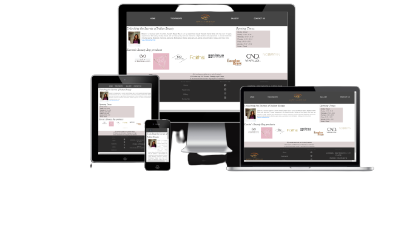

[Live webpage](https://gaborerdei.github.io/project1/)

This is the website for Kavita's Beauty Bay beauty saloon based in London.
Kavita just folows her dreams and over 10 years experience in the beauty industry she opened her first beauty salon.  
It's designed to be responsive and accessible on all devices.

## Table of Content

1. [Project Goal](#project-goal)
  
2. [User Experience](#user-experience)
    1. [Target Audience](#target-audience)
    2. [User Requirements and Expectations](#user-requirements-and-expectations)
    3. [User Stories](#user-stories)

3. [Design](#design)
    1. [Design Choices](#design-choices)
    2. [Colour scheme](#colours)
    3. [Fonts](#fonts)
    4. [Typography](#typography)
    5. [Wireframes](#wireframes)

4. [Features](#features)


5. [Technologies Used](#technologies-used)
    1. [Languages](#languages)
    2. [Frameworks, Libraries, Programs](#frameworks-programs)

6. [Testing](#testing)
    1. [HTML Validation](#HTML-validation)
    2. [CSS Validation](#CSS-validation)
    3. [Accessibility](#accessibility)
    4. [Performance](#performance)
    5. [Device testing](#performing-tests-on-various-devices)
    6. [Browser compatibility](#browser-compatibility)
    7. [Testing user stories](#testing-user-stories)

7. [Deployment](#deployment)

8. [Bugs](#bugs)

10. [Credits](#credits)

11. [Acknowledgements](#acknowledgements)


## Project Goal

Primary goal is to provide an informative good-looking website that showcases Kavita's Beauty Bay and encourages the user to come to the beauty salon. The site will be targeted toward women who are looking for explore the secret of the Inidan beauty.


## User Experience

### Target Audience
- Ages 16 and up.
- Anyone who is interested in beauty treatments.

### User Requirements and Expectations

- A simple and intuitive navigation system,
- Quickly and easily find relevant information,
- Links and functions that work as expected,
- Good presentation and a visually appealing design regardless of screen size,
- An easy way to contact the beauty salon,
- Accessibility.

### User Stories

#### First-time User 
1. As a first-time user, I want to know where the beauty salon is.
2. As a first-time user, I want to know the treatments prices.
3. As a first-time user, I want to know more about the beauty salon, its history and vision.
4. As a first-time user, I want to get a feel for the treatments and atmosphere in the beauty salon.
5. I want to easily contact the beauty salon, if I have any questions.


#### Site Owner 
6. I want users to easily access for the location and traetmenst prices.
7. As the site owner, I want the users to be able to contact the beauty salon.
8. As the site owner, I want to know more about the beauty salon, its history and vision.

## Design

  ### Design Choices
  The layout I chose ensures each specific point of information is easy 
  to access and follows a similar theme to ensure continuity. Kavita's 
  Beauty Bay is a new, indian authentic beauty salon. I want the 
  website clean to represent that.
  

### Colours
As Kavita's Beauty Bay is an indian beauty salon I wanted to add hints of authentic and classic colour (balck and pastel brown, pinkish close to the nature).

The colours I choose are Black, White, slightly pink (background)and light brown.

Specific colours used on the site all taken from a colour picker in InDesign are:
1. Light black: #212529;
2. White: #fffff;
3. Off-white: #fafafa 
4. Light pink: #fbf7fc;
5. Light brown: rgb(220, 210, 210)
6. Orange: orange;

After deciding on the colours I tested them on WebAIM to make sure how the contrast between them worked best.

### Fonts

Fonts were used:
- Alex Brush
- Montserrat
- Sans-serif

I use these fonts as they are clean, easy to read and have a smart appearance and as they are not a commonly used fonts.

### Structure
The page is structured in a user friendly and visually appealing way. Upon arriving the user will notice the recognisable navigation bar, with the company logo on the center. 
All navigation links are placed on the left and right of the company logo.

The website consists of four separate pages: 

- A homepage with a section giving more information on the club (Strapline and short introduction, gallery, reviews and map),
- An Treatments page with information on the founders and why they started the club,
- A Gallery page that introduces the user to the coaches,
- A Contact page with a form for getting in touch.

### Wireframes

<details><summary>Home</summary>
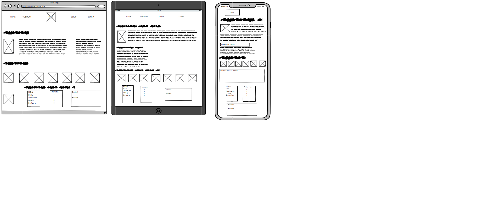
</details>
<details><summary>Treatments</summary>
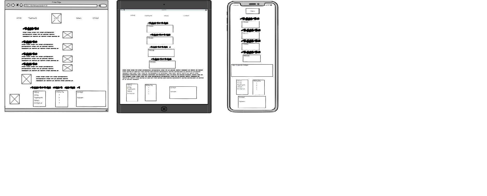
</details>
<details><summary>Gallery</summary>
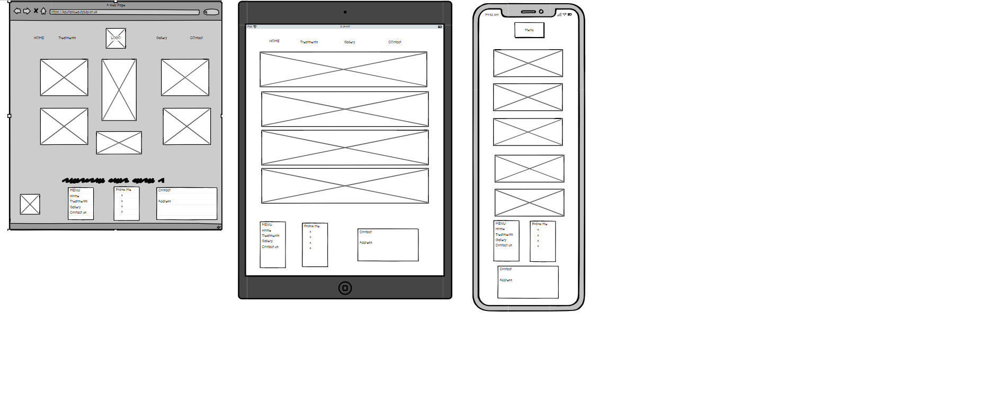
</details>
<details><summary>Prices</summary>
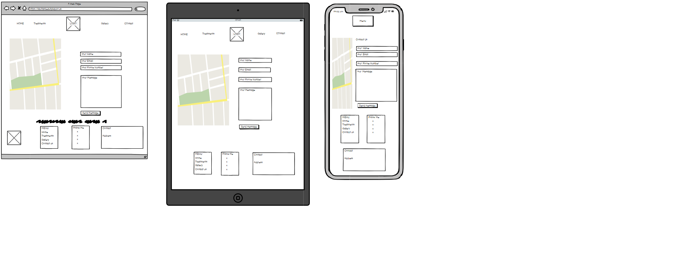
</details>


## Features
The page consists of four pages and features.

### Logo and Navigation Bar
- Featured on all four pages
- The navigation bar is fully responsive and changes to a hamburger menu 
  on smaller screens (desktop, laptop, tablet, phone).
  links to the Homepage, Treatment page, Contact page, Gallery Page. 
- It allows users to easily navigate the pages.
- Hovering the the link for is white underlined from left 
  to right.
- Logo is placed on the center of the site and linked the Index.html.
- User stories covered: 5, 6, 7, 8.


### Map
- Show the beauty salon location on an embedded Google Map.

User stories covered: 1, 6.

### Get In Touch
- A contact form allowing for the user to send message to the beauty 
  salon.
- User stories covered: 5, 8.

### Prices 
- Pricing is broken down into four sections:
    1. Nails
    2. Facial
    3. Waxing
    4. Eyelash
- User stories covered: 2, 6.

### Footer
- Featured on all four pages.
- Consists of 3 separate sections: logo, contact information and social 
  media links.
- User stories covered: 1, , 7, 8.
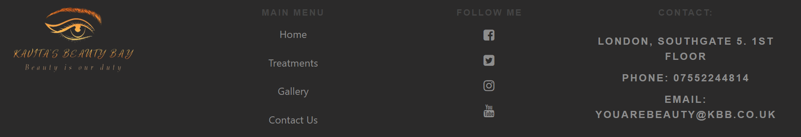

## Technologies Used

### Languages
- [HTML](https://en.wikipedia.org/wiki/HTML)
- [CSS](https://en.wikipedia.org/wiki/CSS)

### Frameworks and Tools
- [HTML validator](https://validator.w3.org/)
- [CSS validator](https://jigsaw.w3.org/css-validator/)
- [Bootstrap v4.5.7](https://getbootstrap.com/)
- [Github](https://github.com/)
- [Codeanywhere](https://www.codeanywhere.com/)
- [Balsamiq](https://balsamiq.com/wireframes/)
- [Google Fonts](https://fonts.google.com/about)
- [Font Awesome](https://fontawesome.com/search)
- [Favicon](https://favicon.io/)


## Testing

### HTML Validation

The W3C Markup Validation Service was used to validate the HTML of the website. All pages pass with no errors.

index.html [results](https://validator.w3.org/nu/?doc=https%3A%2F%2Fgaborerdei.github.io%2Fproject1%2Findex.html)

treatments.html [results](https://validator.w3.org/nu/?doc=https%3A%2F%2Fgaborerdei.github.io%2Fproject1%2Ftreatments.html) 

gallery.html [results](https://validator.w3.org/nu/?doc=https%3A%2F%2Fgaborerdei.github.io%2Fproject1%2Fgallery.html) 

contact.html [results](https://validator.w3.org/nu/?doc=https%3A%2F%2Fgaborerdei.github.io%2Fproject1%2Fcontact.html) 


### CSS Validation
The W3C Jigsaw CSS Validation Service was used to validate the CSS of the website. All pages pass with no errors.

style.css [results](https://jigsaw.w3.org/css-validator/validator?uri=https%3A%2F%2Fgaborerdei.github.io%2Fproject1%2Findex.html&profile=css3svg&usermedium=all&warning=1&vextwarning=&lang=hu)


### Performance
The Lighthouse developer tool was used test the performance of the website. All aspects performing well.

<details><summary>index.html</summary>
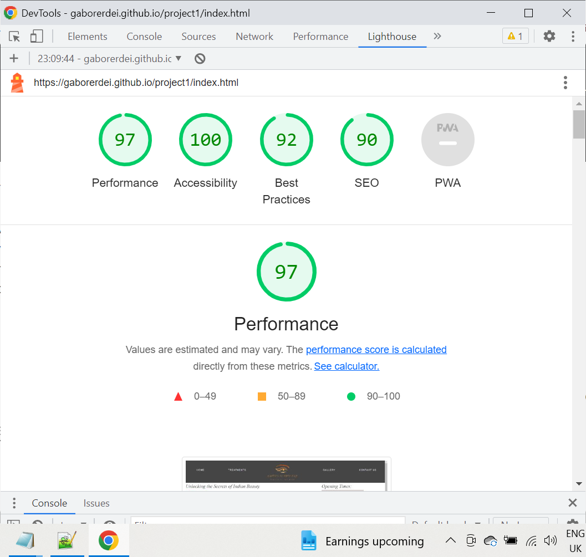
</details>
<details><summary>treatments.html</summary>
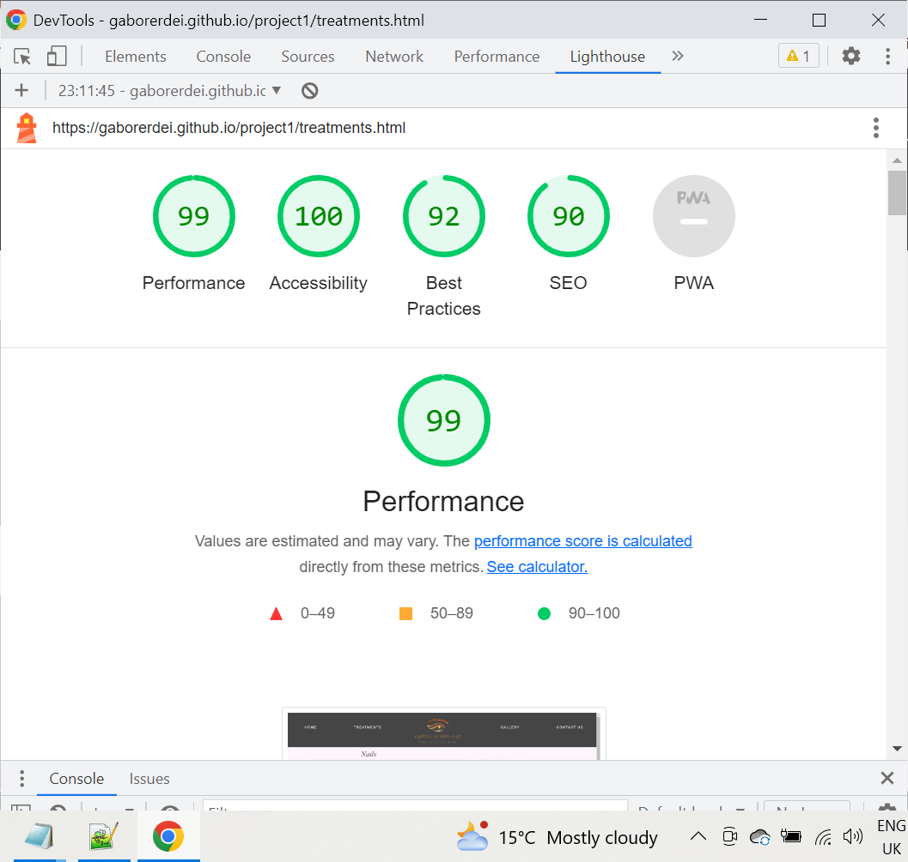
</details>
<details><summary>gallery.html</summary>
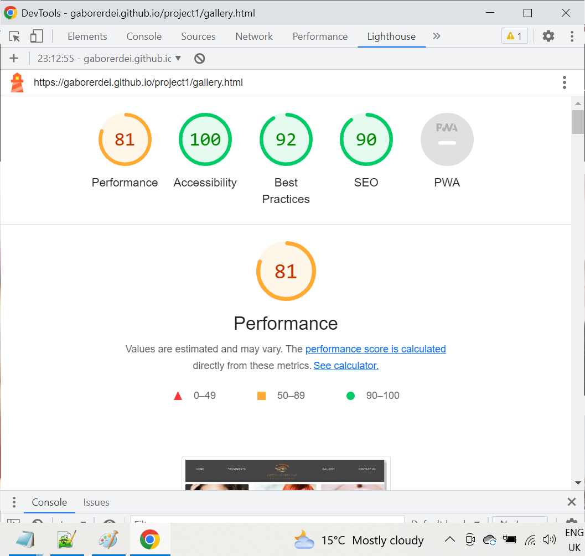
</details>
<details><summary>contact.html</summary>
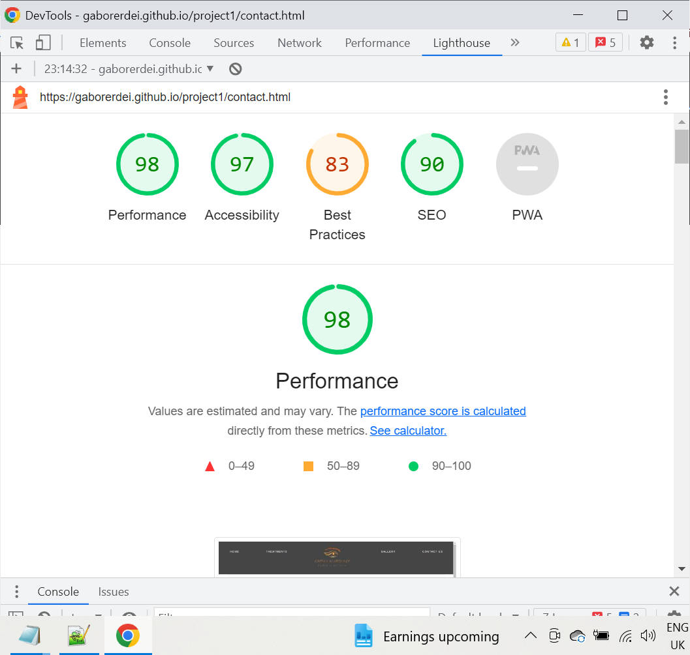
</details>


### Accessibility
The WAVE WebAIM web accessibility evaluation tool was used to ensure the website met high accessibility standards. All pages pass with 0 errors.

index.html [results](https://wave.webaim.org/report#/https://gaborerdei.github.io/project1/index.html) 

treatments.html [results](https://wave.webaim.org/report#/https://gaborerdei.github.io/project1/treatments.html)

gallery.html [results](https://wave.webaim.org/report#/https://gaborerdei.github.io/project1/gallery.html)

contact.html [results](https://wave.webaim.org/report#/https://gaborerdei.github.io/project1/contact.html)


### Performing tests on various devices 
The website was tested on the following devices:
- MacBook Pro
- Ipad Tablet
- Lenovo laptop HD screen
- Desktop

### Browser compatibility
The website was tested on the following browsers:
- Google Chrome
- Mozilla Firefox
- Apple Safari


### Testing user stories

#### First-time User

1. As a first-time user, I want to know where the beauty salon is.

| **Feature** | **Action** | **Expected Result** | **Actual Result** |
|-------------|------------|---------------------|-------------------|
| Map | On Index page scroll down the bottom | Locating a map showing the location of the gym | Works as expected |
| Footer - contact information section | On any page scroll down to the footer | Find the address of the gym | Works as expected |
<br>

2. As a first-time user, I want to know the treatments prices.

| **Feature** | **Action** | **Expected Result** | **Actual Result** |
|-------------|------------|---------------------|-------------------|
| Treatments menu | On Index page click on 'Treatments' menu on nav bar | Find Prices page with all pricing | Works as expected |
| Navigation Bar | On any page at the top click on 'Treatments' | Find Treatments page with all pricing | Works as expected |
<br>

3. As a first-time user, I want to know more about the beauty salon, its history and vision.

| **Feature** | **Action** | **Expected Result** | **Actual Result** |
|-------------|------------|---------------------|-------------------|
| Navigation Bar | On Index page click on 'Home' menu on nav bar   | Find Index page with story of the salon| Works as expected |
<br>

4. As a first-time user, I want to get a feel for the treatments and atmosphere in the beauty salon.

| **Feature** | **Action** | **Expected Result** | **Actual Result** |
|-------------|------------|---------------------|-------------------|
| Navigation Bar | On any page at the top click on 'Gallery' | Find About page with more photos about the salon | Works as expected |
| Show Gallery | On Gallery page scroll down to gallery | Find images of the beauty salon  | Works as expected |
<br>

5. As a first-time user, I want to easily contact the beauty salon, if I have any questions.

| **Feature** | **Action** | **Expected Result** | **Actual Result** |
|-------------|------------|---------------------|-------------------|
| Navigation Bar | On any page at the top click on 'Contact Us' | Find Contact page with more information | Works as expected |
| Footer | On Index page scroll down to 'Footer'  | Find address, phone number, email address and social icons | Works as expected |
<br>

#### Site Owner 

6. As the site owner, I want users to easily access for the location and traetmenst prices.

| **Feature** | **Action** | **Expected Result** | **Actual Result** |
|-------------|------------|---------------------|-------------------|
| Navigation Bar | On any page at the top click on 'Treatments' | Find Treatment Prices | Works as expected |
| Navigation Bar | On any page at the top click on 'Contact Us' | Find Salon Location | Works as expected |


7. As the site owner, I want the users to be able to contact the beauty 
salon.

| **Feature** | **Action** | **Expected Result** | **Actual Result** |
|-------------|------------|---------------------|-------------------|
| Navigation Bar | On any page at the top click on 'Contact Us' | Find Contact page with more information | Works as expected |
| Footer | On Index page scroll down to 'Footer'  | Find address, phone number, email address and social icons | Works as expected |
<br>

8. As the site owner, I want to know more about the beauty salon, its history and vision.

| **Feature** | **Action** | **Expected Result** | **Actual Result** |
|-------------|------------|---------------------|-------------------|
| Navigation Bar | On Index page click on 'Home' menu on nav bar   | Find Index page with story of the salon| Works as expected |
<br>


## Deployment

The website was deployed using GitHub Pages by following these steps:

1. Make sure the branch you want to use as your publishing source 
   already exists in your repository,

2. On GitHub, navigate to your site's repository,

3. Under your repository name, click  Settings. If you cannot see the 
   "Settings" tab, select the  dropdown menu, then click Settings,
   

4. In the "Code and automation" section of the sidebar, click  Pages.

5. Under "Build and deployment", under "Source", select Deploy from a 
   branch.

6. Under "Build and deployment", use the branch dropdown menu and select 
   a publishing source.
   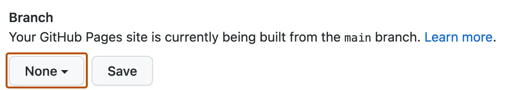

7. Optionally, use the folder dropdown menu to select a folder for your 
   publishing source.
   

8. Click Save.

9. After the webpage refreshes automatically you will see a ribbon on 
   the top saying: Your site is live at 
   https://gaborerdei.github.io/project1


You can for fork the repository by following these steps:
1. Go to the GitHub repository
2. Click on Fork button in upper right-hand corner


You can clone the repository by following these steps:
1. Go to the GitHub repository 
2. Locate the Code button above the list of files and click it 
3. Select if you prefer to clone using HTTPS, SSH, or Github CLI and click the copy button to copy the URL to your clipboard
4. Open Git Bash
5. Change the current working directory to the one where you want the cloned directory
6. Type git clone and paste the URL from the clipboard ($ git clone https://github.com/YOUR-USERNAME/YOUR-REPOSITORY)
7. Press Enter to create your local clone.


## Bugs and fixes

- My Codeanywhere credits has been ran out, so I just bought new credits.

- All navbar menus link has to be changed in the Header on all page from 
  href="/index.html"> to  href="index.html">. Without this 
  modification you will get 404 error. 

- Having tested the Contact us page map and form position on all 
  devices. I noticed using a form size of a specific px cause them to be 
  out of place on different devices. Using a ' width:120px' unit  with 
  specific media queries commands instead allows them respond better 
  ensuring they are in a good position on all devices.

##### Media Query commands
```css
        @media(max-width: 994px) {
    
    .nav-link {
        margin-top: 5px;
        margin-left: 15px;
    }

    .nav {
        margin-left: 25px;
    }
 
    .navbar-nav {
        gap: 1px;
    }

    .navbar-toggler-icon {
        color:rgb(220, 210, 210);
    }

    .logo {
        display: none;
    }

    .main-header{
        min-width: 100%;
        margin-left: 10px;
    }

    .logos {
        margin-left: 10px;
    }

    .supplier-logo {
        padding-left: 10px;
        justify-content: center;
    }

    .pricelist-header{
        min-width: 100%;
        margin-left: 10px;
        text-align: center;
    }

    .treatments-table {
        font-family: Alex Brush;
        margin-left: 10px;
    }
    .treatments-photo {
        display: none;
    }

    .offer-photo {
        display: none;
    }

    .container .contact-form input {
        width: 140px;
    }

    .container .contact-form textarea {
        width: 140px;
    }

    .container .contact-form .btn-send {
        width: 140px;
    }

    .container .map {
        margin-top: 15px;
    }
    .offer-card {
        margin-left: 0px;
    }

    .contact {
        margin-top: 23px;
        padding-left: 25px;
    }    
}
```
##### MAP
The map had a grey line under so wasn't flush to the footer, after using 
google inspect I noticed the container was a different height the map so 
matched both heights to 400px which fixed the issue.

#### Original code
```css
            .map {
                height: 602px;
                width: 100%;
            }
```
#### Code fix
```css
            .map {
                height: 602px;
                width: 100%;
            }

            .map iframe {
                height: 530px;
                width: 100%;
                }
```


## Credits

Images and logos not referenced below are owned or created by the developer.

### Media

All photos were taken from [Freepik](https://www.freepik.com/)
Logos made by [BrandCrowd](https://www.brandcrowd.com/)

### Footer Icons
The icons in the footer were taken from Font Awesome 
[FontAwsome](https://fontawesome.com/icons)

#### Index Page

- Text provided by client
- [Freepik](docs/kavita2.png)

- Product logos can dowload from the original sites of the 
   manufacturer.
  
#### The Treatments Page
  - Text and prices provided by client
  - Photos for the treatments sections

  - [Freepik Nail](https://www.freepik.com/) search nail treatments
  - [Freepik Facial](https://www.freepik.com/) search facial treatments
  - [Freepik Waxing](https://www.freepik.com/) search waxing 
  - [Freepik Eyelash](https://www.freepik.com/) search eyelash
   

#### Gallery Page

 - [Bootstrap Gallery](https://mdbootstrap.com/docs/standard/extended/gallery/)


#### The Contact Page
 Form and map I frame created by developer.


### Code 

In order of appearance;

- The HTML for the responsive [Navbar with toggler]
(https://getbootstrap.com/docs/5.0/components/navbar/) was taken from Boostrap v5.0 documentation snippet.

- The HTML for the Nav Bar [Nvbar](https://getbootstrap.com/docs/5.0/components/navbar/#responsive-behaviors) was taken from Boostrap v5.0 documentation snippet.


## Acknowledgements

I would like to take the opportunity to thank:

- Cardiff and Wale College and my Tutor Iris for their suppoirt and help,
- My mentor, Mo Shami, for his excellent feedback, advice support and 
  guidance throughout,
- Tutor support from Code Institute,
- The slack community of coders for helpful replies,
- and to my family.


